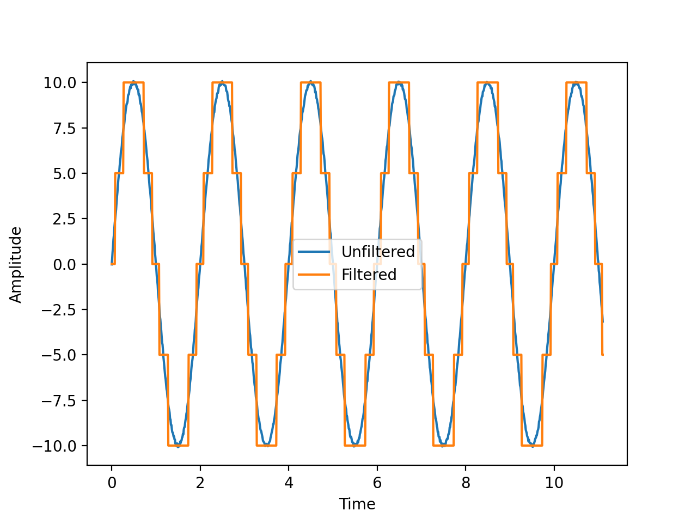

### 👋 Hello! Welcome to my the walk-through of the generation of an N-bit Data Acquisition (DAQ) System! 

---

In this walk-through, we focus on two major topics:

1) The principles of digitization of a simulated signal
2) How to logically structure a multi-directory set of python files

---

The goal of the first topic is to emulate a n-bit data acquisition system. Our code takes the generated signal (a sin wave), re-samples it, then displays the new digitized signal at the same time as the original signal.

We also want to utilize ```__init__.py``` files to take advantage of the multi-directory system. To read more about the ```__init__.py``` file, check out [this link](https://stackoverflow.com/questions/448271/what-is-init-py-for)! As you can see in the GitHub repo, there are multiple folders (directories) used in this project. while this may be overkill for this type of problem, it is still an important tool to have on hand. Each directory essentially contains a mathematical function used to generate the digital signal. However, the ```__init__.py``` file essentially allows a python file to act as an imported module. This can have many benefits and drastically increase the simplicity of your code. 

---

Below, you can see the output of our code:

<p align="center">
  
</p>

As you can see, the original signal (blue) is over-layed with a digitized square signal (orange). 

NOTE: the time start and end constraints are arbitrary. 

---

### Source:


---

<center> 

#### For more information about me, check out my website by clicking on the logo!

<p align="center">
  <a href="https://liamnester.github.io/" </a> 
</p>